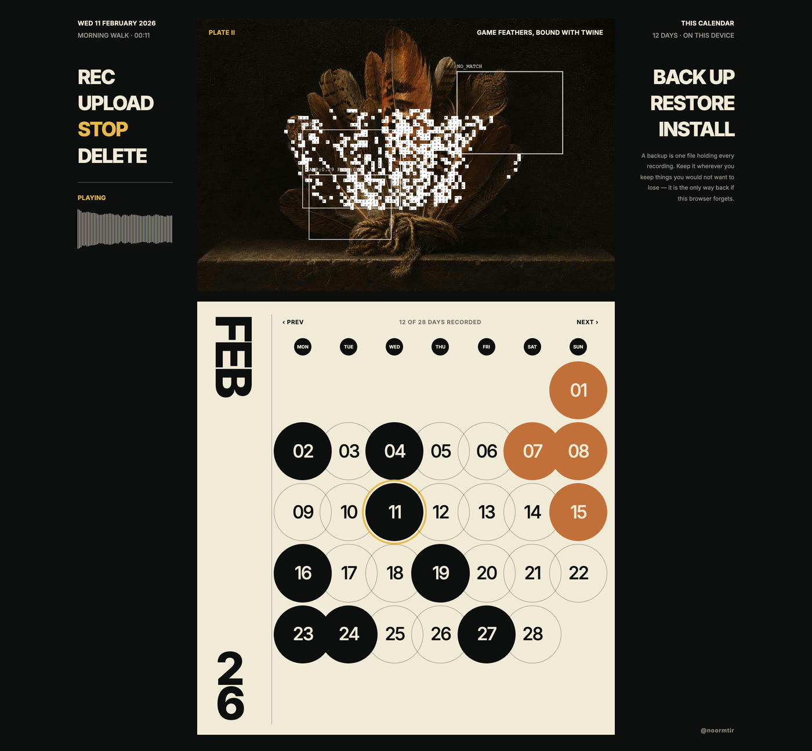
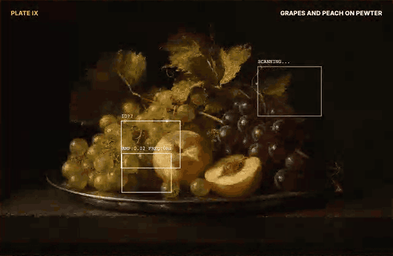
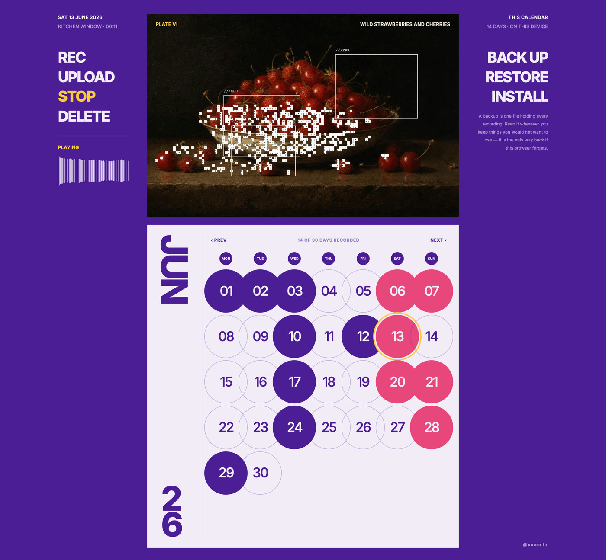
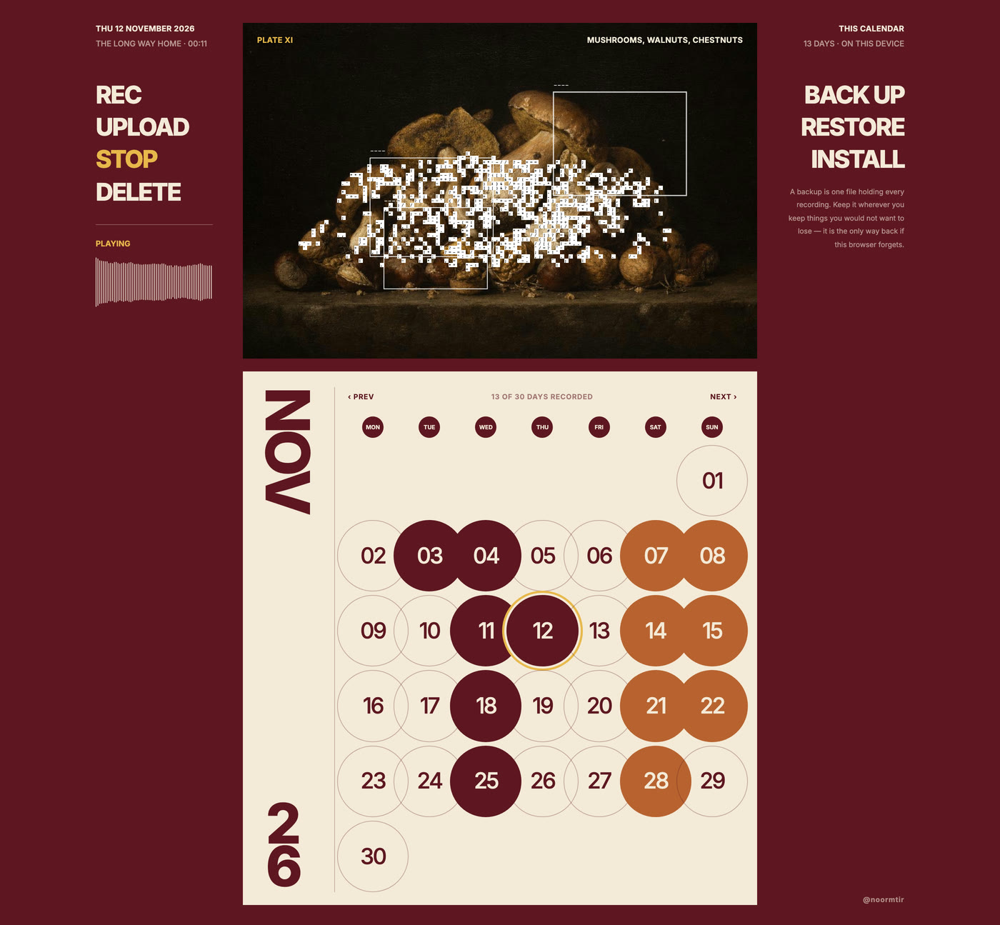

<div align="center">

# Voice Calendar

**A journal you speak instead of write.**
One voice note per day, on a wall calendar. It never leaves your browser — no account, no server, nothing sent anywhere.

**[calendar.nawwara.studio](https://calendar.nawwara.studio)**

[](https://github.com/NourMtir0722/calendar/actions/workflows/ci.yml)



<sub>February · playback in progress · the plate is scanning the voice it is playing</sub>


</div>

---

Each day holds one clip: a voice note you record in the browser, or a track you upload. The
still life at the top of the page is scanned by an ASCII layer driven by whatever that day sounds
like.

Nothing is uploaded and there is nobody to sign up to. Recordings are written to IndexedDB in the
browser that made them and stay there, which is the whole architecture.

It is a wall calendar: one sheet, everything in view, nothing scrolls. Twelve months, twelve
paintings, each with its own plate number, subject line and an accent colour, so the page shifts
colour across the year.

```
┌────────┬──────────────────┬─────────┐
│        │                  │         │
│ REC    │   the plate      │ BACK UP │   margins are typography,
│ UPLOAD │   ASCII scanning │ RESTORE │   not a toolbar, no icons
│ PLAY   │   to the voice   │ INSTALL │
│ DELETE │                  │         │
│        ├──────────────────┤         │
│        │ SEP │ ● ● ○ ● ●  │         │   filled = holds a voice
│        │  26 │ ○ ○ ○ ○ ○  │         │   outline = still empty
└────────┴──────────────────┴─────────┘
```

A day is always selected: today, when the page opens. Clicking another day selects it and plays
what is stored there. Record and upload are never more than one click away.

```bash
npm install
npm run dev
```

## The plate scans what it hears

<div align="center">



<sub>September · one clip playing · nothing is pre-rendered, every frame is the live analyser</sub>

</div>

The scan is not decoration played on a timer. It is drawn from the audio that is playing, every
frame, out of the same `AnalyserNode` the waveform in the margin is drawn from:

- **Loudness decides how far it spreads.** The RMS of the current buffer sets the coverage, which
  drives both the radius and the threshold a cell has to clear to be drawn, so the field blooms as a
  voice rises and thins back to bare painting when it drops. Silence draws nothing at all.
- **Pitch decides which columns light up.** The plate's width is mapped across the frequency bins,
  so the left of the image answers to the low end and the right to the high. A voice lights a
  different part of the painting than a piano does.
- **Loudness also sets the pace.** Cells re-roll to a neighbouring character, and the interval
  between rolls runs from 400ms down to 30ms as the amplitude climbs, so a loud passage visibly
  churns where a quiet one barely stirs.
- **The painting decides the characters, and where the scan may go.** Every 12px cell takes the
  average luminance beneath it, and that picks its character off a ramp from `.` to `@` — so the
  field is a luminance rendering of the plate rather than noise laid over it. Cells under a
  luminance of 30 are dropped when the image is sampled, which is why the scan lives on the lit
  fruit and never touches the black ground.
- **It blooms from the subject, not the frame.** The centre it grows out of is the
  luminance-weighted centroid of the plate, worked out once per image, so each of the twelve
  paintings scans from its own subject instead of from the middle of the panel. Which cell surfaces
  first is a per-cell hash biased by distance from that centre, so the edge of the field dithers
  outward rather than sweeping as a hard circle.

It moves only while something is playing, because it is the thing you pressed the button to see.
The ambient parts — the drifting boxes, the flickering OCR captions — are held still under
`prefers-reduced-motion`, which is exactly the never-asked-for motion that preference exists to
refuse.

## The year changes colour

Three palettes, one per four-month block. The month decides the palette. There is no theme switch,
so there is one source of truth.

<table>
<tr>
<td width="33%"></td>
<td width="33%"></td>
<td width="33%"></td>
</tr>
<tr>
<td align="center"><b>INK</b> · <code>JAN–APR</code><br><sub>oysters · feathers · tulips · blossom</sub></td>
<td align="center"><b>VIOLET</b> · <code>MAY–AUG</code><br><sub>peonies · strawberries · melon · figs</sub></td>
<td align="center"><b>OXBLOOD</b> · <code>SEP–DEC</code><br><sub>grapes · mushrooms · pomegranate</sub></td>
</tr>
</table>

Each palette is contrast-checked: paper on ground and ground on paper clear 4.5:1, and accent on
ground plus paper on warm clear 3:1 for large type.

**Sampling colour from the paintings does not work**, which is worth recording because it looks like
the obvious idea. Dutch still lifes are all warm mid-tones, so against a saturated ground eight of
the twelve sampled accents fall under 3:1. December's pomegranate red lands at 1.17:1, effectively
invisible. The grounds work precisely because they are the paintings' complement, not their match.

## It stays in your browser, which cuts both ways

Recordings go to IndexedDB and no further. There is no server to hold them, no account to lose, and
no request that carries audio anywhere — `connect-src` is `'none'`, so a page that tried to send one
would be stopped by its own policy.

That is the privacy story and the risk in the same sentence. A browser is allowed to throw its
storage away: Safari deletes script-created storage after seven days without a visit, and clearing
site data ends a journal at any time. Nobody, including me, can bring it back, because nobody else
ever had it.

So the app says that once, when the first recording is made, and gives you two answers rather than a
warning:

- **BACK UP** writes every recording into one file: plain JSON, one day per line, with the audio
  inside it. No dependency to read it, no format only this app understands, and nothing of mine that
  has to still exist in five years. Keep it wherever you keep things you would not want to lose.
  **RESTORE** reads it back a line at a time, so a year of recordings never has to fit in memory at
  once; it leaves any day already on the device alone, because an old backup landing on a calendar
  that has moved on must not take this morning with it.
- **INSTALL** adds the calendar to the home screen. An installed web app is exempt from Safari's
  seven-day rule outright, which is the only dependable defence against it.

## Scripts

| | |
| --- | --- |
| `npm run dev` | Vite dev server |
| `npm run build` | typecheck app and tests, then build |
| `npm test` | both suites once |
| `npm run test:watch` | both suites, watching |
| `npm run test:e2e` | the browser smoke suite, in Chromium |
| `npm run deploy` | build, then deploy the static app |
| `npm run lint` | oxlint |
| `npm run preview` | serve the production build |

## The long version

The reasoning behind most of this is written down rather than left in the commits. None of it is
needed to run the app.

| | |
| --- | --- |
| [Decisions worth knowing](docs/decisions.md) | Local dates over UTC, one `AudioContext`, the backup format, the layout clamped by both axes, and the rest of the choices that have a reason behind them. |
| [Architecture](docs/architecture.md) | The file tree, the layout rules, the month table, and what the test suites each cover. |
| [SECURITY.md](SECURITY.md) | What this does and does not protect, and how to report a hole in it privately. |

## What this protects, and what it does not

The short version, because it is the part worth knowing before you keep a year of mornings in it:
your recordings are on your device and nowhere else, so no host can read them and no breach of mine
can reach them — and equally, **nothing can recover them for you.** A cleared browser is a finished
journal unless you have a backup file. Anyone with your unlocked device has your journal, the same
way they have your photos.

[SECURITY.md](SECURITY.md) writes that out properly, along with how to report a vulnerability
privately.

## Licence

Apache-2.0, see [LICENSE](LICENSE), for the code.

The twelve month illustrations were generated with GPT for this project. Purely AI-generated images
may not attract copyright at all in some jurisdictions, so rather than grant rights I may not hold,
the honest position is this: I claim nothing over them and you may do as you like with them.
